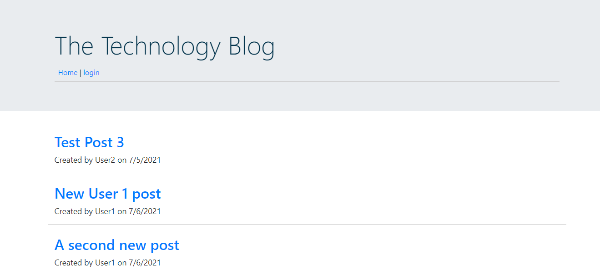
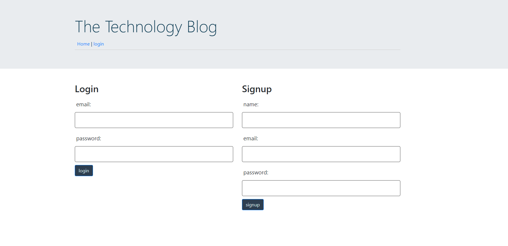
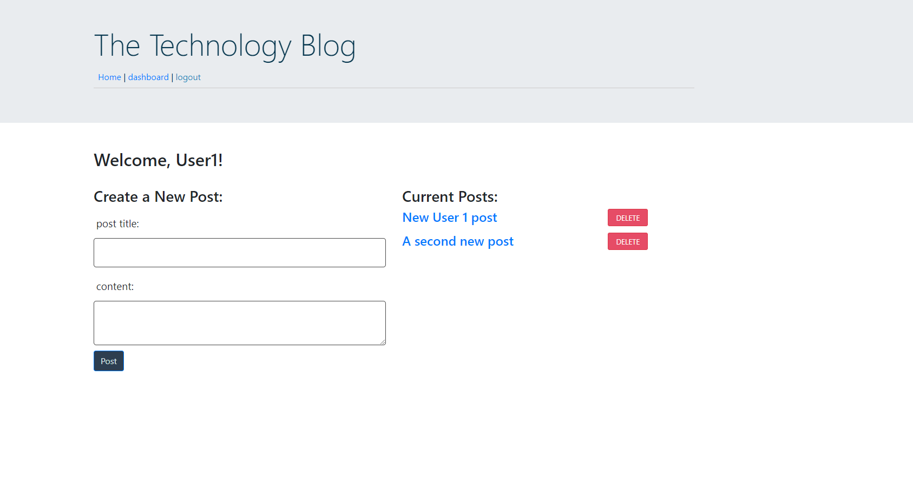
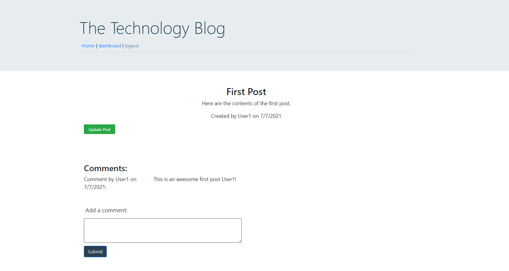

# TechBlog
[](https://opensource.org/licenses/MIT) 
## Description: 
This is an application for a blog where developers can publish and comment on posts. This application uses node.js, an express server, and handlebars. You can install and run on a local server, or use the deployed version.     
## Table of Contents: 
* [Installation](#installation)
* [Usage](#usage) 
* [License](#license) 
* [Contributing](#contributing) 
* [Questions](#questions) 
## Installation: 

* You will need to have Node.js and MySQL installed. 
* Run ```npm install``` in your bash terminal to install the dependencies.
* Update your MySQL user and password in the ``` .env.EXAMPLE ``` file then rename it to ``` .env ```. 
* Run ```DROP DATABASE IF EXISTS techblog_db;``` and then```CREATE DATABASE techblog_db;``` in MySQL shell to create the database in MySQL. 
* Run ```node seeds/seed.js``` in your bash terminal to seed the database
* Run ```npm start``` to initialize the server on your local machine, then once you get the message "App is listening on PORT: 3001", go to localhost:3001 in your browser. 

[Or click here for deployed app](https://technologyblog.herokuapp.com/) 
 
## Usage: 
From the homepage you can view post titles with who posted them and when. To view the contents of a post or make comments you must log in. If you are not yet registered, the login page has a separate section where you can sign up. Once logged in you will see your dashboard where you can create a new post, and delete any posts you have previously created. When you go to the homepage you can view all post titles, just click on the one you want to read. After you have clicked on a post, there is a section where you can add a comment.  If you are viewing your own post, there is a button which will take you to a form to make any updates to your post. 









## License: 
Licensed under the [MIT](https://opensource.org/licenses/MIT) license. 
## Contributing: 
Feel free to contact me to contribute to this project. My contact information is listed below.

## Questions: 
GitHub: [melinamboedecker](https://github.com/melinamboedecker) 

If you have any additional questions, please contact me at melinamboedecker@gmail.com